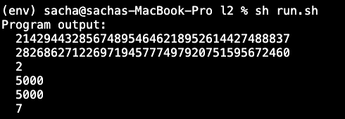

# StarkDebtAllocator
The objective of this PoC is decentralizing even more the process to choose strategy weights within a vault. 

StarkDebtAllocator is the contract in charge of receiving and validating debt ratio proposals, that will come from any proposer.  

It uses (zk-)STARKS through Starware's Cairo, SHARP prover and L1 verifier to generate proofs that make it possible to be sure that they are valid solutions without spending a ton of gas running the computation on-chain.	

To incentivize people running the calculations and proposing solutions, the solution proposer will earn rewards during the time their solution is used. 	

## Intro	
Currently, debt ratios are proposed by vault managers and approved by a multisig. Vault managers analyze how each of the strategies is performing, checking their different APYs and then come up with a set of debt ratios, which are set manually. 

{	
    "strategy1": 2500,
    "strategy2": 2500,
    "strategy3": 3500,	
    "strategy4": 1500	
}	

This process requires manual intervention and brings a lot of overhead with it.	

## Solution	
The PoC is composed of 2 parts: L1 smart contract and Cairo Program	

StarkDebtAllocator is one Ethereum L1 smart contract. 	

It implements two (main) functions:	
- saveSnapshot(): reads all the on-chain data that will be used as inputs for the Cairo Program and hashes them all, then saves the hash	
- verifySolution(uint256[] programOutput): 	
	- parses programOutput to the following values: uint256 inputsHash, uint256[] debtRatios, uint256 newAPY, 	
	- checks that the inputsHash has been saved before as is not stale and that it corresponds to the inputsHash used in the cairo program (from programOutput). Note that cairo felt isn't big enought to support 256 bits (252 bits max), that's why 2 slot of the programOutput are used to calculate the input hash from strategies input, 128 bits each.	
	- checks that each debt ratio is not bigger than the maxValue stored for the associated strategy	
	- checks that the CairoVerifier from Starkware has received the proof and confirmed it is correct	
	- checks that the new solution is better than the previous solution	
	- sets the new winning solution, the new debt ratio array and store the address of the user.	

apy_calculator.cairo is the Cairo program that takes a set of debt ratios for certain strategies and calculates the weighted average APY for the whole set of strategies. 	

This Cairo program will compute a hash of all the inputs it has used to calculate APYs to send it to the L1 smart contract, so inputs can be validated. 	

## Details	
	

## Test

run npx hardhat test test/debtAllocatorTest.js

## Script	

Follow these steps: 	
- Provide your private key in the .env

- Deploy DebtAllocator.sol providing by running deployDebtAllocator.js (the cairo verifier address is  0xAB43bA48c9edF4C2C4bB01237348D1D7B28ef168 on Goerli and you can find the cairo programHash running sh programhash.sh)

- Add Strategies with addStrategy.js, , you need to provide the strategy address, the contracts and selectors you want to pick your data, and the calculation logic tab (more details below)

- Invoke saveSnapshot(). The function returns the strategies input tab, use it to fill apy_calculator_input.json. 	

- Choose a new debt ratio configuration for the stratgies and add it in apy_calculator_input.json ("debt_ratio":[2000, 7500, 500] for exemple).Compile, run the cairo program and send its proof to the SHARP, you can use sh run.sh to do it in one step.	
	

- Invoke verifySolution providing the output you got from the last step.

## Calculation Logic

Each Strategy APY is calculated in the cairo program hash. Better than modifying the cairo program every time a new strategy is added (which involves modifying the cairo program hash on the debtAllocator contract), the strategy APY calculation is given as an input. 

The calculation follow this logic: 

Each step performs an operation of 2 operands.
The operand is between 0 and 10000, we take the value of the input data
The operand is between 10000 and 20000, we take the value of the last calculation steps.
The operand is more than 20000, we take the value - 20 000
the operation is described by a uint, 0 = +, 1 = -, 2 = x, 3 = /

Exemple for a strategy: 
Input: [4,7,2]
Calculation_logic: [[1,0,0], [10000,2,2], [10001,20010,1], [10002,2,3]]
step1 -> 7 + 4
step2 -> 11 (step1) * 2
step3 -> 22 (step2) - 10 (20010 - 20000)
step4 -> 12(step3) / 2

res = 6